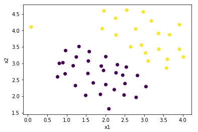

# Linear Classifier using SVM Cost Function
```
Dataset: Machine Learning by Andrew Ng, Week 7 Assignment
```
## Cost Function 
- if y = 1
  - 0 if x >= 1
  - -x + 1 if x < 1
- if y = 0
  - 0 if x <= -1
  - x + 1 if x > 1

## Dataset Preview


### Loss vs Number of Iterations for C = 1
.png)

### Decision Boundary for C = 1
.png)

### Loss vs Number of Iterations for C = 100
.png)

### Decision Boundary for C = 100
.png)


SVM Decision Boundary is shifted because of outliers at higher value of C as depicted in above images of Decision Boundaries at C=1 and C=100
